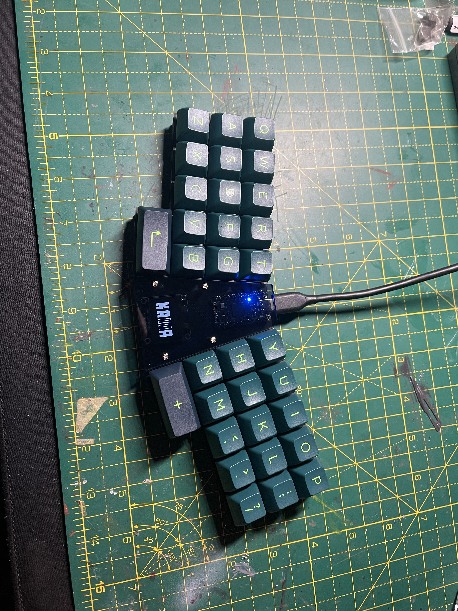
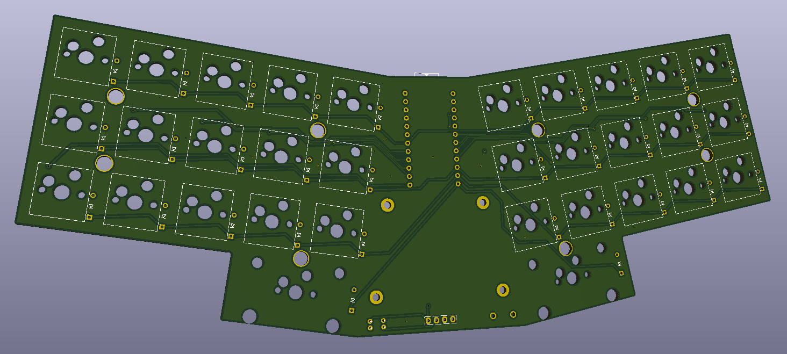
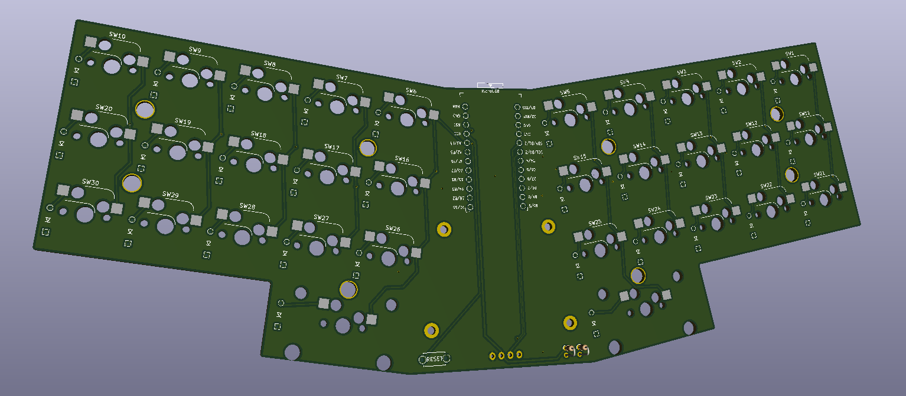

# Kawa
## A 32 key 'fixed-split' pro-micro based keyboard with a 128x64 OLED display.

Forked from CoffeeBreakKeyboards [here](https://github.com/CoffeeBreakKeyboards/kawa) and updated to use Kailh Hotswap Sockets. 

A sandwich mount case was also created based on the original Kawa PCB footprint. The central section around the OLED and controller board is covered with a sheet of acrylic. 

*Pic of Kawa build courtesy of Porkus*

## Case
Plate files created:
 - Base Plate x1
 - Top Plate x2
 - Acrylic Centre Guard x1

## PCB Preview
Kawa PCB Top Preview

Kawa PCB Bottom Preview

## Firmware

Firmware files are available [here](https://github.com/sofubi/qmk_firmware/tree/kawa/rev0.1/keyboards/handwired/kawa)

